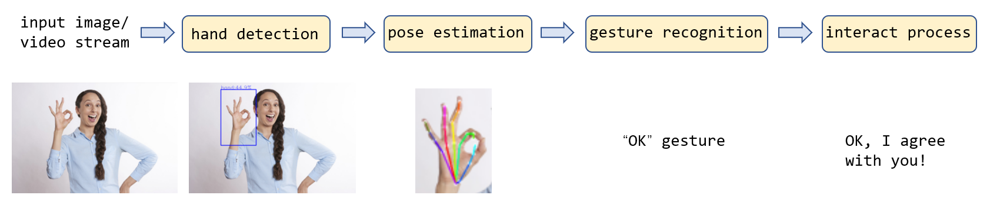
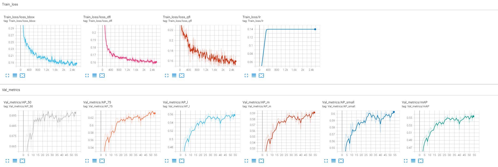
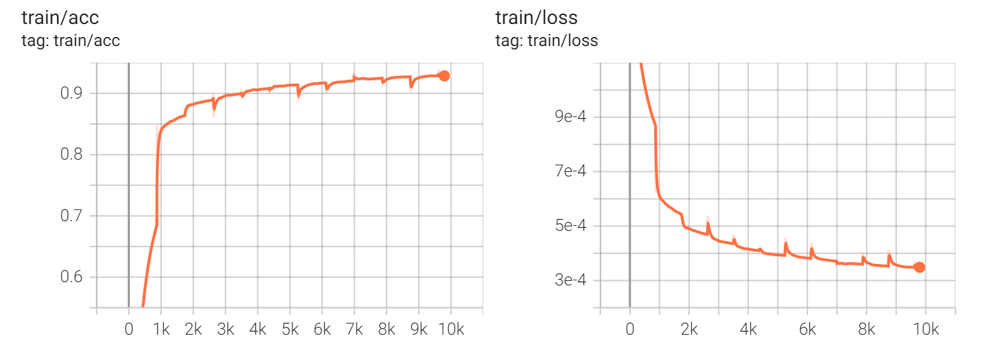
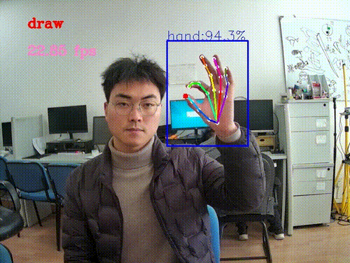
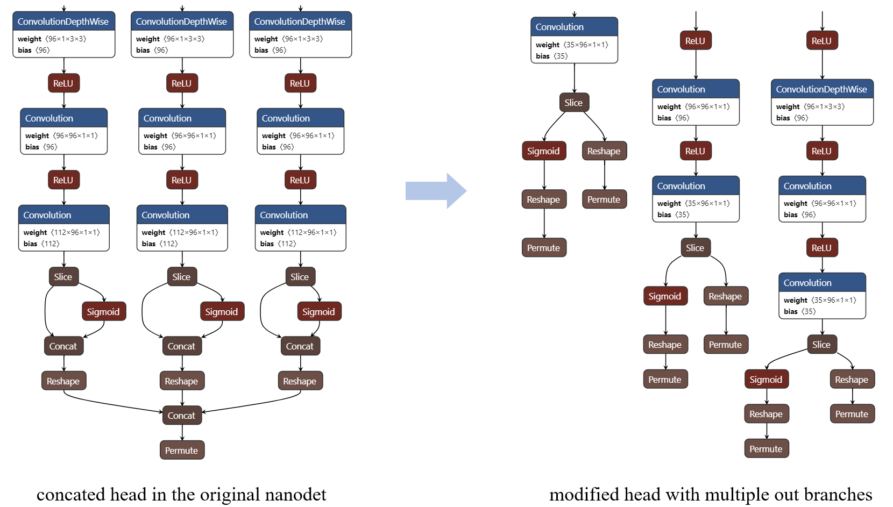
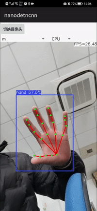

# GestureDet

Welcome to GestureDet! This repo is highly inspired by [YOHA](https://github.com/handtracking-io/yoha). Since the author has no plan to release the dataset and the training code ([see this issue](https://github.com/handtracking-io/yoha/issues/7)), I try to implement one from scratch by myself. This demo mainly contains the following main parts:

- **Datasets collection**: I collect the datasets by aggregating from various public datasets and collecting some by myself. 
- **Model Selection and training**: The models are chosen with real-time performance in mind and trained with Pytorch. 
- **Interactive demo design**:  I implement an interactive demo, in which users can draw on the screen when pose specific gestures. 
- **Model conversion and deployment**: I further deploy the models with ncnn and TensorRT, respectively.

The whole pipeline consists of hand detection, hand pose estimation, gesture recognition and the following interactive process  (drawing using specific gesture is designed in this demo).



- hand detection: get the bounding box of all hands in the input image.
- hand pose estimation: get the location of joints for each hand.
- gesture recognition: recognize the gesture according the estimated hand pose.
- interactive process: do some interactive process according to the gesture, like drawing etc.

## A quick demo using mediapipe
[mediapipe](https://github.com/google/mediapipe) provides some really awesome ML solutions, in which the [Hands solution](https://google.github.io/mediapipe/solutions/hands) can serve as a quick and neat baseline for this task. 

We can easily run 
```python
python MediapipeGestureDet.py
```
and we will get the result like this:


Seems Good! But what if we want to use custimized model or add custimized training dataset? This is exactly what this repo tries to do. Let's go!

## Train a GestureDet model from scratch

### dataset collection

Data matters. I establish two reasonably big and good-annotated datasets for GestureDet model training: **hand detection dataset** and **hand pose estimation dataset**.

- The hand detection dataset is aggregated from [EgoHands](http://vision.soic.indiana.edu/projects/egohands/) and my self recorded data. It contains **`9170` train samples and `93` validate samples**. The annotations are arranged into COCO format. 

- The hand pose estimation dataset is aggregated from [GANerated Hands Dataset](https://handtracker.mpi-inf.mpg.de/projects/GANeratedHands/GANeratedDataset.htm),  [MHP](http://www.rovit.ua.es/dataset/mhpdataset/), and my self-recorded data. It contains **`111749` train imags and `1128` validate images.** Each image has at leat 1 hand on it and each hand has 21 joints.

[Here](./docs/datasets_prepare.md) is a more detailed intro about how I collect and process these two datasets.

### model selection
GestureDet is built with performance in mind, so I choose lightweight model for more efficient inference:

- For hand detection, I choose [NanoDet](https://github.com/RangiLyu/nanodet).
- For hand pose estimation, the model arch in [Ultralight-SimplePose](https://github.com/dog-qiuqiu/Ultralight-SimplePose) is used.
	
	> Note: The original implementation of Ultralight-SimplePose is based on mxnet, and I re-implement a Pytorch version here.

### train
Now comes the training process.
#### hand detection model training
NanoDet utilize [Pytorch Lightning](https://github.com/PyTorchLightning/pytorch-lightning) for enjoyable training, we can simply follow the instruction in the NanoDet readme:
```bash
cd nanodet
# I modify `configs/nanodet-m.yml` as config file, see `nanodet-m_hand.yml` for more info
python tools/train.py nanodet-m_hand.yml
```
I get the training and validating curve like this:



After training, I get the detection model with mAP of 0.5644. The checkpoint can be downloaded from [here](https://pan.baidu.com/s/1JT5vzP-KLkdUFaSmGRnJQg?pwd=tupz) and placed in the folder `./Detector/nanodet/workspace/nanodet_m_hand/`

#### hand pose estimation model training
For image pre-processing, model training and result post-processing, I largely refer to [AlphaPose](https://github.com/MVIG-SJTU/AlphaPose).
```bash
# PATH_TO_DATASET is the directory where the train_pose.json and val_pose.json save
python train.py --data_root PATH_TO_DATASET
```
While training, the image with ground-truth joints and predict joints will be shown in tensorboad panel.
I get the training and validating curve like this:



The validate curve is forgotten to be recorded... (this curve image maybe replaced in the future).

The checkpoint can be downloaded from [here](https://pan.baidu.com/s/1z6b1LMYNnvj-xxPBtLN0GQ?pwd=twgz) and placed in the folder `./PoseEstimator/UltralightSimplePose/checkpoints/`

### inference

Using the trained model, I get the inference result like this:



The whole pipeline can run at **~27 fps** on my machine (one TITAN X GPU).


## deploy
### ncnn

I firstly convert the Pytorch model to ncnn model, and then develop an Android App for deployment.

#### hand detection model conversion 
<u>STEP1: model conversion</u>
1. convert Pytorch to onnx model
    ```bash
    cd nanodet
    python tools/export_onnx.py --cfg_path ${CONFIG_PATH} --model_path ${PYTORCH_MODEL_PATH}
    ```
    Note that the onnx model has been simplified in `export_onnx.py`.
2. convert onnx model to ncnn model
    ```bash
    onnx2ncnn nanodet.onnx nanodet.param nanodet.bin
    ```
3. optimize ncnn model
    ```bash
    ncnnoptimize nanodet.param nanodet.bin nanodet_hand.param nanodet_hand.bin 0
    ```

<u>STEP2: nanodet_op.param file modification</u>



The author of NanoDet concatenate all the (`len(strides) * 2`) output blobs to only one blob for simpler model arch. However, this will deliver extra calculation and slow down the inference. So I remove the concatenation operation by modifying the nanodet_op.param manually.

- The model arch can be easily visulized using [netron](https://netron.app/).
- [This](https://bbs.cvmart.net/articles/3972) is a good article introducing ncnn. What each line of *.param file means is introduced in section 0x02.01 
- **NOTE:** After manully changing the layers in *.param, the layer number and blob number  in the network may be changed.  In turn, the two number in the second line of the param, which exactly indicates `layer num` and `blob num` should also be adjusted, or some unexpected warning like `find_blob_index_by_name xxx failed` may be encountered.

Now, the `nanodet_hand.param` and `nanodet_hand.bin` is ready to be loaded.

#### hand pose estimation model conversion
Model conversion routine `pytorch -> onnx -> ncnn` is commonly used (as what I do in the hand detection model convertion process). Recently [pnnx](https://github.com/Tencent/ncnn/blob/master/tools/pnnx/README.md) is introduced for more convenient conversion. So **I tried pnnx following pnnx readme**:

1. convert pytorch model to TorchScript model:
    ```python
    net = UltraLightSimplePoseNet().eval()
    ckpt = torch.load(PATH_TO_CKPT)
    net.load_state_dict(ckpt)
    
    x = torch.rand(1, 3, 256, 192)
    mod = torch.jit.trace(net, x)
    torch.jit.save(mod, "./pose_torchscipt.pt")
    ```
2. convert TorchScript to pnnx
    ```bash
    pnnx ./pose_torchscipt.pt inputshape=[1,3,256,192]
    ````

3. optimize the generated ncnn model

    ```bash
    ncnnoptimize pose_torchscipt.ncnn.param pose_torchscipt.ncnn.bin hand_pose.param hand_pose.bin 0
    ```

Then I get 6 files as expected and I take the `pose_torchscipt.ncnn.param` and `pose_torchscipt.ncnn.bin` to be loaded.

#### GestureDet Android ncnn demo
I implement a GestureDet Android demo using the converted ncnn models. The android demo can be found in `demo_ncnn_Android`. **This demo can run as fast as 25 fps with Kirin 990.**



The interactive process in Android demo is left for future work.

### GestureDet TensorRT demo

[torch2trt](https://github.com/NVIDIA-AI-IOT/torch2trt) is an easy to use Pytorch-to-TensorRT model converter.  I use this tool to do the model conversion in this step. 

The usage of torch2trt convertion is simple (refered to the official repo):

```python
import torch
from torch2trt import torch2trt
from torch2trt import TRTModule

# create some regular pytorch model
model = YOUR_MODEL.eval().cuda()
# create a dummy input data
x = torch.ones(<your_input_size>).cuda()
# convert to TensorRT feeding sample data as input
model_trt = torch2trt(model, [x])
# save the generated trt module
torch.save(model_trt.state_dict(), TRT_MODEL_PATH)
# load and inference
model_trt = TRTModule()
model_trt.load_state_dict(torch.load(TRT_MODEL_PATH))
y_trt = model_trt(x)
```
> **Note:** For NanoDet, the head module contains both model inference and output postprocess step. However, the head part in the converted TensorRT model can only do the former task (if I am not making mistakes), so I inherit a dummy class `NanoDetDummyHead` from the original `NanoDetHead`. The `NanoDetDummyHead` has all the the output postprocess functions of `NanoDetHead` but has no any model params. So it can serve as a plugin postprocess helper when TersorRT inference is used.

It is easy to turn on the TensorRT inference mode on in this repo: Just set `TRT_INF = True` in the `demo.py` , we are done. 

when I use TensorRT inference, I get the speed of **~29 fps**, which is slight faster than the raw Pytorch GPU model inference in my case. 

Enjoy it and any issues are welcomed! 


## Credits and referred materials

The following materials help me a lot when I develop this repo. Great thanks to them and their authors!

- [Mediapipe - Hands solution](https://google.github.io/mediapipe/solutions/hands)
- [ultralytics/yolov5](https://github.com/ultralytics/yolov5) 
- [RangiLyu/NanoDet](https://github.com/RangiLyu/nanodet)
-  [dog-qiuqiu/Ultralight-SimplePose](https://github.com/dog-qiuqiu/Ultralight-SimplePose)
- [MVIG-SJTU/AlphaPose](https://github.com/MVIG-SJTU/AlphaPose)
- [Tencent/ncnn](https://github.com/Tencent/ncnn)
- [NVIDIA-AI-IOT/torch2trt](https://github.com/NVIDIA-AI-IOT/torch2trt)

